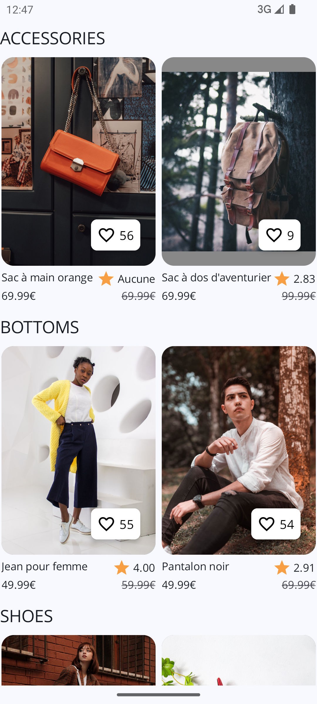
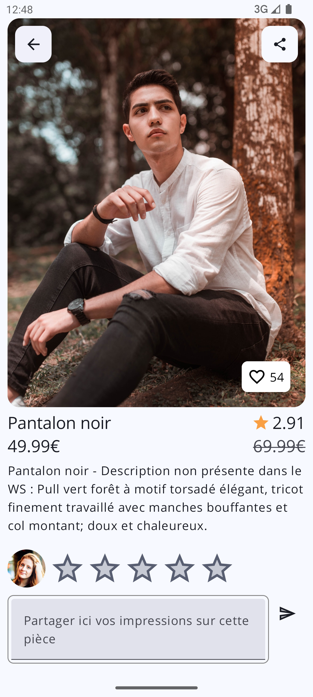
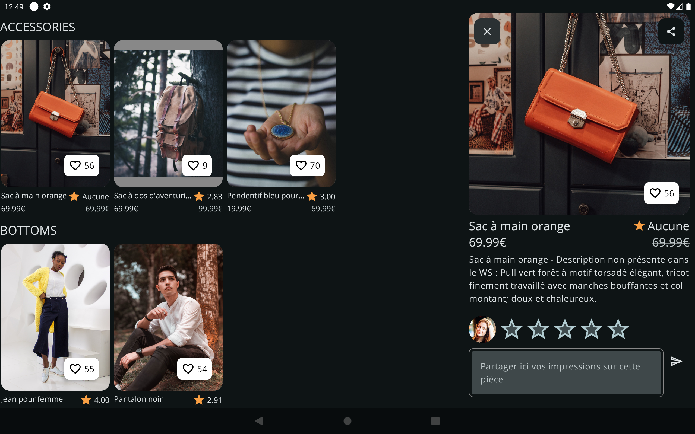

# P12 - Projet Joifull

Application permettant de consulter, noter, liker et partager des articles.
Accessibilité de l'application validée via Accessibility Scanner.

## Technologies
- Jetpack Compose
- Kotlin 
- Retrofit

## Concepts

- Pattern : MVVM
- UI : Thèmes clair et sombre
- Tests : Unitaires
- Deep links

## Screenshots

    
    

